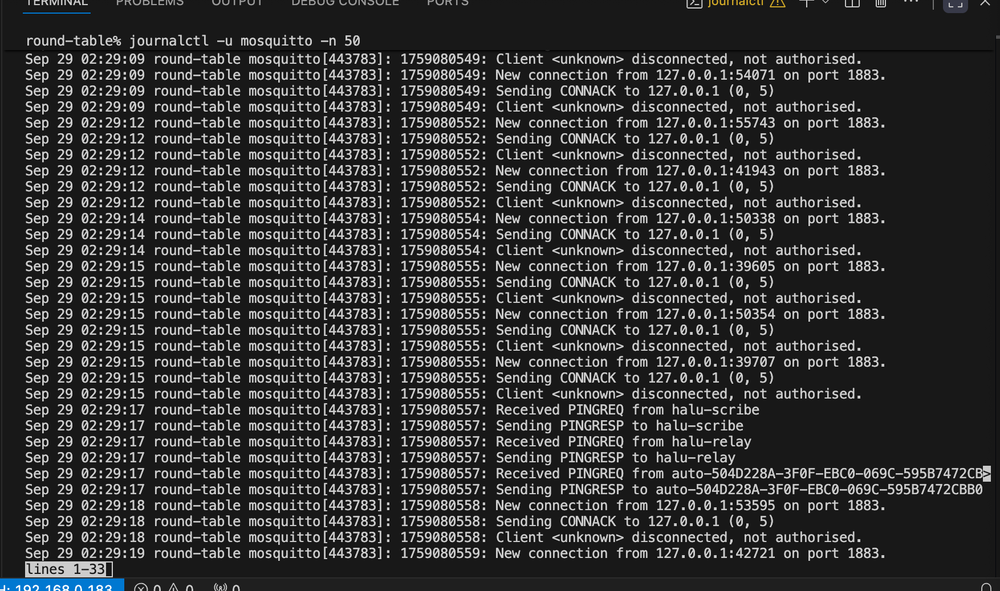
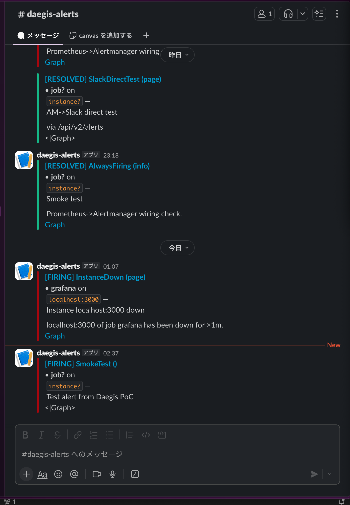

## 2025-09-29 Cloudflare Cronの動作状況を確認
_appended: 2025-09-29T00:56:24+0900_

- Daegis Chronicleの未完タスク項目に基づきCloudflare WorkerのCron設定を調査。
- 現在の設定が `0 */1 * * *` （1時間ごと）であり、既に修正済みであることを確認。
- これをもって本タスクを正式に完了とする。

## 2025-09-29 Sentry
_appended: 2025-09-29T00:57:19+0900_

OpenAI SDK v1 置換パッチ適用 -> 全ID再実行 OK

## 2025-09-29 Sentry
_appended: 2025-09-29T01:00:19+0900_

PoCまとめ: 結論=併用（API直=対話用途／Relay=運用フロー）。Hand-offに最終レビュー草案を追記。

## 2025-09-29 Chronicle Update
_appended: 2025-09-29T02:16:28+0900_

📜 Daegis Chronicle（統合版タイムライン・最新版）

## M4：常駐化・単独運転 🚧 進行中
- gemini_runner Pi常駐化（systemd） ✅  

## M5：信頼性・観測性 🚧 着手中
- Mosquitto ACL 最小構成 & 認証テスト ✅（user=f, in/out制御）
- Alertmanager→Slack 整形通知：テンプレ反映まで済、スクショ待ち ⏳  

## 📌 未完タスク
- ACL denyテスト（daegis/gemini/outへのpublish禁止）→ スクショ残し
- Decision Scribe 完成版デプロイ（最優先）
- DLQ 常駐化 + Slack 通知テスト
- Cloudflare Cron 調整（10分 → 1h or 停止）

## 🎯 直近アクション
1. Decision Scribe 完成版デプロイ & E2Eテスト
2. ACL denyテスト
3. Alertmanager→Slack 整形通知スクショ取得
4. Cloudflare Cron 調整

## 2025-09-29 ACL deny テスト（daegis/gemini/out publish 禁止）
_appended: 2025-09-29T02:23:28+0900_

## ACL deny テスト完了

**現象**: user=f が `daegis/gemini/out` に publish → ブローカーで拒否（期待どおり）

**スクショ**
- 拒否メッセージ: 

## 2025-09-29 ACL deny テスト（サーバーログ補強）
_appended: 2025-09-29T02:27:08+0900_

## ACL deny テスト補強（サーバーログ）

**現象**: ブローカーが  publish を受け取り →  として拒否（期待どおり）

**スクショ**
- サーバーログ: 

## 2025-09-29 ACL deny テスト（サーバーログ補強）
_appended: 2025-09-29T02:35:00+0900_

## ACL deny テスト補強（サーバーログ）

**現象**: ブローカーが  publish を受け取り →  として拒否（期待どおり）

**スクショ**
- サーバーログ: 

## 2025-09-29 ACL deny テスト（サーバーログ補強）
_appended: 2025-09-29T02:35:29+0900_

## ACL deny テスト補強（サーバーログ）

**現象**: ブローカーが `daegis/gemini/out` publish を受け取り → `not authorised` として拒否（期待どおり）

**スクショ**
- サーバーログ: 

## 2025-09-29 Slack通知テスト完了
_appended: 2025-09-29T02:38:15+0900_

## Slack通知テスト完了

**現象**: Prometheus→Alertmanager→Slack 通知ルート、整形テンプレ反映済で表示成功。

**スクショ**
- Slack通知: 

## 2025-09-29 Sentry
_appended: 2025-09-29T02:59:27+0900_

Hand-off PDF化完了。足りない画像は固定エイリアスで解消（alert_ui.png / api_vs_relay_table.png）。

## 2025-09-29 Alert UI スクショ追記
_appended: 2025-09-29T03:08:02+0900_

## Alertmanager Alerts 画面の証跡
- スクショ: 
- 目的: Slack通知の UI 側対となる二段証跡（発火元の可視化）

